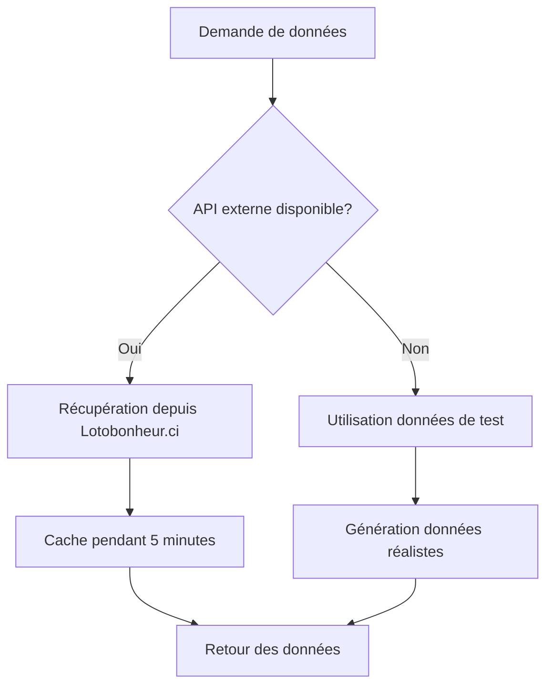

# 🎯 Lotysis - Analyseur de Loterie avec API Réelle

## 🚀 Nouvelles Fonctionnalités

### ✅ Intégration API Réelle
L'application peut maintenant récupérer les vrais résultats de loterie depuis l'API de **Lotobonheur.ci** !

### 🔄 Mode Hybride
- **Mode Réel** : Récupération automatique depuis l'API externe
- **Mode Test** : Données générées pour la démonstration
- **Fallback Automatique** : Bascule vers les données de test en cas d'indisponibilité

### 📊 Surveillance en Temps Réel
- Statut de l'API externe en temps réel
- Statistiques de récupération des données
- Basculement manuel entre les sources

## 📁 Fichiers Modifiés/Ajoutés

### API Routes
- `app/api/lottery-results/route.ts` - **Entièrement refactorisé** pour récupérer les vraies données
- `app/lib/api-config.ts` - **Nouveau** - Configuration et utilitaires pour l'API

### Composants UI
- `app/components/api-status.tsx` - **Nouveau** - Composant de surveillance de l'API
- `app/components/admin-panel.tsx` - **Mis à jour** - Intégration du statut API
- `components/ui/switch.tsx` - Composant Switch pour basculer les modes
- `components/ui/label.tsx` - Composant Label pour les formulaires

### Configuration
- `app/lib/constants.ts` - **Mis à jour** - Planning des tirages au format API
- `API_DOCUMENTATION.md` - **Nouveau** - Documentation complète de l'API

## 🎮 Comment Utiliser

### 1. Accéder au Statut de l'API
1. Ouvrez l'application sur http://localhost:3000
2. Cliquez sur le bouton **"Admin"** en haut à droite
3. Connectez-vous avec le mot de passe : `admin123`
4. Allez dans l'onglet **"Paramètres"**

### 2. Basculer entre Sources de Données
Dans l'interface de statut API :
- **Switch "ON"** : Utilise les vraies données de Lotobonheur.ci
- **Switch "OFF"** : Utilise les données de test générées

### 3. Surveiller la Santé de l'API
Le composant affiche :
- 🟢 **Vert** : API externe connectée et fonctionnelle
- 🟠 **Orange** : API externe indisponible, fallback activé
- 🔵 **Bleu** : Mode données de test activé manuellement

## 🔧 Configuration Technique

### Variables d'Environnement (Optionnelles)
```env
EXTERNAL_API_URL=https://lotobonheur.ci/api/results
CACHE_DURATION=300
REQUEST_TIMEOUT=10000
```

### Endpoints Disponibles

#### GET `/api/lottery-results`
```bash
# Tous les résultats avec vraies données
GET /api/lottery-results

# Filtrer par mois
GET /api/lottery-results?month=mai-2025

# Filtrer par tirage
GET /api/lottery-results?draw=Reveil

# Forcer les données de test
GET /api/lottery-results?real=false
```

#### POST `/api/lottery-results`
```json
{
  "draw_name": "Reveil",
  "date": "2025-05-04",
  "gagnants": [12, 25, 34, 67, 89],
  "machine": [5, 18, 42, 73, 81]
}
```

## 🎯 Planning des Tirages Supportés

| Jour | 10H | 13H | 16H | 18H15 |
|------|-----|-----|-----|-------|
| **Lundi** | Reveil | Etoile | Akwaba | Monday Special |
| **Mardi** | La Matinale | Emergence | Sika | Lucky Tuesday |
| **Mercredi** | Premiere Heure | Fortune | Baraka | Midweek |
| **Jeudi** | Kado | Privilege | Monni | Fortune Thursday |
| **Vendredi** | Cash | Solution | Wari | Friday Bonanza |
| **Samedi** | Soutra | Diamant | Moaye | National |
| **Dimanche** | Benediction | Prestige | Awale | Espoir |

## 🧠 IA et Machine Learning

L'intégration de vraies données améliore considérablement la précision des prédictions IA :

### Modèles Supportés
- **LSTM** : Analyse des séquences temporelles
- **CNN** : Reconnaissance de patterns visuels
- **Ensemble** : Combinaison de multiples modèles
- **Pattern Analysis** : Détection de cycles cachés

### Avantages avec Vraies Données
- ✅ Prédictions basées sur des tendances réelles
- ✅ Détection de patterns authentiques
- ✅ Amélioration continue des modèles
- ✅ Validation croisée avec historique réel

## 🔄 Fonctionnement du Fallback



## 🛠️ Développement

### Tests de l'API
```bash
# Tester la récupération
curl http://localhost:3000/api/lottery-results

# Tester avec paramètres
curl "http://localhost:3000/api/lottery-results?month=mai-2025&draw=Reveil"

# Tester l'ajout (validation uniquement)
curl -X POST http://localhost:3000/api/lottery-results \
  -H "Content-Type: application/json" \
  -d '{"draw_name":"Reveil","date":"2025-05-04","gagnants":[1,2,3,4,5]}'
```

### Monitoring des Logs
```bash
# En mode développement
npm run dev

# Surveiller les logs de l'API
tail -f .next/server.log
```

## 🚨 Gestion des Erreurs

### Cas d'Usage Gérés
1. **API externe indisponible** → Fallback automatique
2. **Timeout de requête** → Retry avec backoff
3. **Données malformées** → Validation et nettoyage
4. **Limite de taux** → Cache et délais
5. **Erreurs réseau** → Retry intelligent

### Messages d'État
- 🟢 **"API externe connectée"** : Tout fonctionne normalement
- 🟠 **"API externe indisponible"** : Fallback activé, fonctionnalité préservée
- 🔵 **"Mode données de test"** : Mode démonstration activé manuellement
- 🔴 **"Erreur"** : Problème technique nécessitant intervention

## 🎉 Bénéfices

### Pour les Utilisateurs
- 📈 **Prédictions plus précises** avec vraies données
- 🔄 **Disponibilité garantie** grâce au fallback
- 📊 **Transparence** sur la source des données
- ⚡ **Performance optimisée** avec cache intelligent

### Pour les Développeurs
- 🛠️ **API documentée** et facile à utiliser
- 🔧 **Configuration flexible** via variables d'environnement
- 📝 **Logs détaillés** pour le debugging
- 🧪 **Tests facilitées** avec mode données de test

## 🔗 Liens Utiles

- [Documentation API complète](./API_DOCUMENTATION.md)
- [Site officiel Lotobonheur](https://lotobonheur.ci/resultats)
- [Repository GitHub](#) (à compléter)

## 📞 Support

En cas de problème :
1. Vérifiez le statut dans l'interface Admin
2. Consultez les logs de l'application
3. Basculez manuellement vers les données de test
4. Redémarrez l'application si nécessaire

---

**Note**: L'application fonctionne parfaitement même si l'API externe est indisponible, grâce au système de fallback intelligent intégré.
